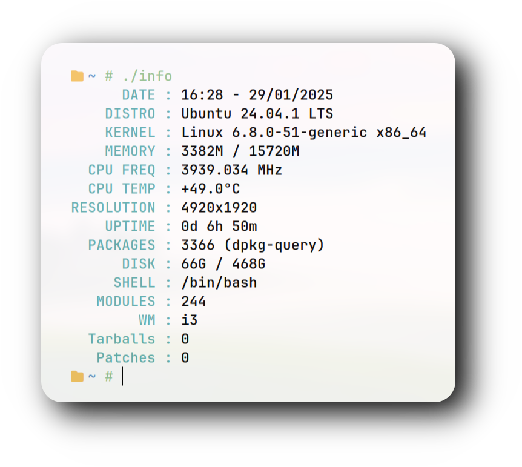

<div align="center">


### 𝙄𝙣𝙨𝙩𝙖𝙡𝙡𝙖𝙩𝙞𝙤𝙣 🥳

```
curl -fsSL https://raw.githubusercontent.com/user7210unix/info-fetch/main/build.sh | bash
```

<div align="center">

<h1>
      
</div>
</div> 


## ⚙️ Features

- :bento:  Displays essential system information.
- :rocket: Supports various Linux window managers.
- :leaves: Provides memory, CPU, and much more.
- :shell:  Easy to use and extend.

<div align="center">


### :octocat: ‎ <sup><sub><samp>HI THERE! THANKS FOR DROPPING BY!</samp></sub></sup>
